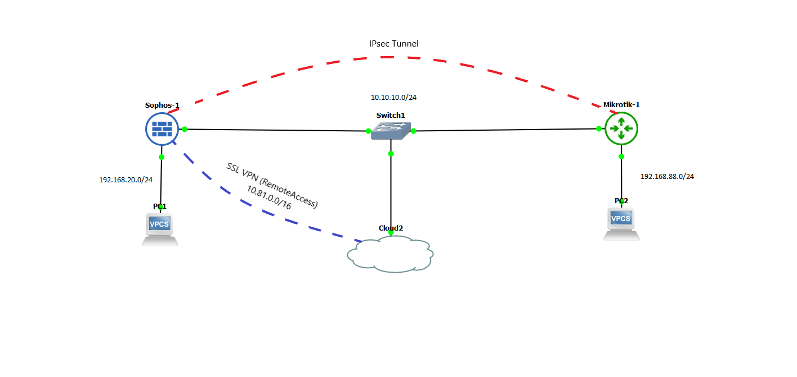
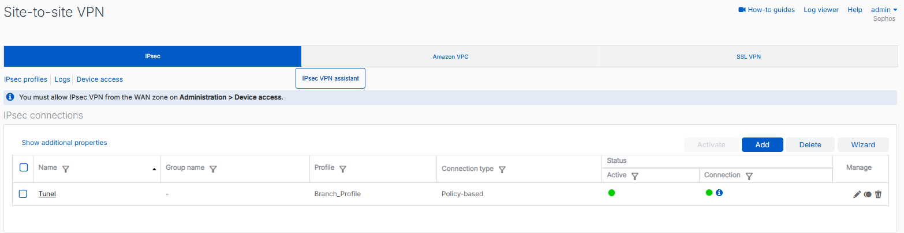
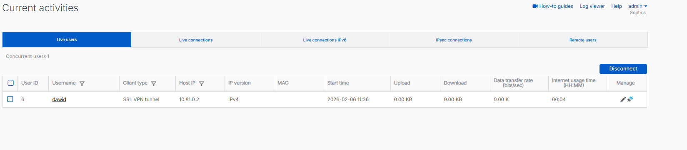
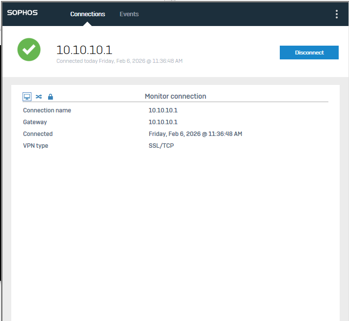
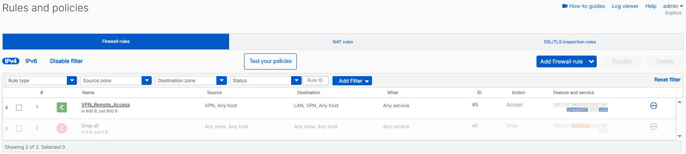
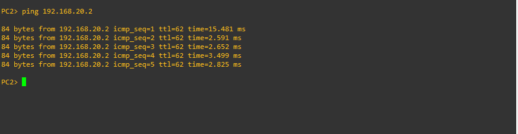
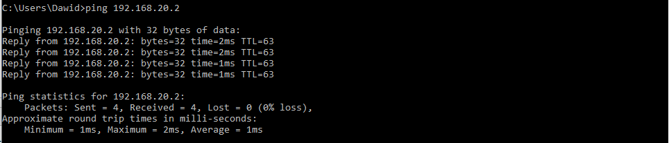

# Symulacja Sieci VPN: Sophos Firewall & MikroTik

  
   
  <em> Schemat logiczny i fizyczny sieci. Widoczna warstwa fizyczna (czarne linie), tunel Site-to-Site IPsec łączący oddziały (czerwona przerywana linia) oraz tunel SSL VPN dla pracowników zdalnych (niebieska przerywana linia).</em>

    
    
    
    

## O Projekcie

Projekt przedstawia symulację infrastruktury sieciowej dla firmy posiadającej centralę oraz oddział zdalny. Głównym celem było zapewnienie bezpiecznej, szyfrowanej komunikacji między lokalizacjami oraz umożliwienie pracownikom mobilnym dostępu do zasobów wewnętrznych firmy z dowolnego miejsca na świecie.

**Wykorzystane Technologie i Standardy:**

- **Firewall:** Sophos XG - zarządzanie strefami i inspekcja ruchu.
- **Router Edge:** MikroTik RouterOS - obsługa oddziału.
- **VPN Protocols:**
  - **IPsec:** Tryb tunelowania (Tunnel Mode), uwierzytelnianie PSK.
  - **SSL VPN:** Dostęp zdalny oparty o certyfikaty (TCP/443).
- **Network Security:** NAT Exemption, Stateful Firewall, Zone-based Policies.

---

## Szczegóły Implementacji

### 1. Tunel Site-to-Site (IPsec VPN)

Zestawiono tunel typu **Policy-Based VPN** łączący podsieć centrali (`192.168.20.0/24`) z podsiecią oddziału (`192.168.88.0/24`). Konfiguracja obejmowała uzgodnienie parametrów IKE (Phase 1) oraz IPsec (Phase 2) między urządzeniami różnych producentów.

- **Kluczowe elementy konfiguracji:**
  - Ustalenie wspólnych algorytmów szyfrowania (AES-256) i haszowania (SHA-256).
  - Konfiguracja _Pre-Shared Key_ (PSK) do uwierzytelniania peerów.
  - Wyłączenie NAT dla ruchu tunelowanego.

  <strong>Status połączenia (Sophos):</strong> 
  
   
  <em>Dashboard Sophos potwierdza zestawienie tunelu. Zielone wskaźniki oznaczają poprawną negocjację obu faz IPsec.</em>

  <strong>Weryfikacja na routerze (Mikrotik):</strong> 
  
   
  <em>Weryfikacja w terminalu CLI. Polityka IPsec posiada status `active`, co oznacza, że router poprawnie przechwytuje ruch między zdefiniowanymi podsieciami i kieruje go do szyfrowania.</em>

### 2. Dostęp Zdalny

Dla pracowników mobilnych wybrano technologię **SSL VPN** ze względu na jej niezawodność w publicznych sieciach. Użytkownicy logują się przez dedykowany Portal Użytkownika, pobierają konfigurację klienta i uzyskują bezpieczny dostęp do sieci LAN.

  <strong>Monitor aktywnych użytkowników:</strong> 
  
   
  <em>Widok sesji użytkownika `dawid`. System przydzielił wirtualny adres IP `10.81.0.2`, który jest następnie routowany wewnątrz sieci firmowej.</em>

  <strong>Portal Klienta:</strong> 
  

### 3. Bezpieczeństwo i Firewall

Kluczowym elementem było skonfigurowanie reguł, które ściśle określają, jaki ruch może przepływać przez tunel.

  <strong>Reguły Firewall:</strong> 
  
   
  <em>Reguła `VPN_Remote_Access` kontroluje ruch przychodzący ze strefy VPN. Dzięki temu, nawet po podłączeniu, użytkownik ma dostęp tylko do określonych zasobów, a nie całej sieci.</em>

---

## Weryfikacja Działania

Ostatecznym testem poprawności konfiguracji była weryfikacja łączności warstwy 3 (ICMP) między hostami końcowymi.

  <strong>Test Site-to-Site (PC w oddziale -> Centrala):</strong> 
  
   
  <em>Ping z hosta w sieci MikroTik (88.x) do hosta w sieci Sophos (20.x). Czas odpowiedzi potwierdza brak pętli routingowych i poprawne reguły firewall.</em>

  <strong>Test Remote Access (Pracownik zdalny -> Centrala):</strong> 
  
   
  <em>Pracownik zdalny (Internet) skutecznie komunikuje się z wewnętrznym komputerem firmy przez tunel SSL.</em>

